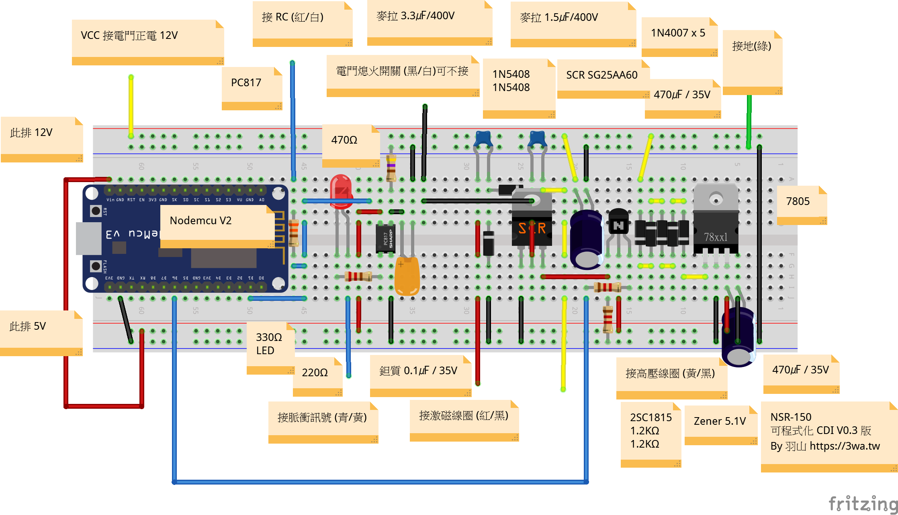
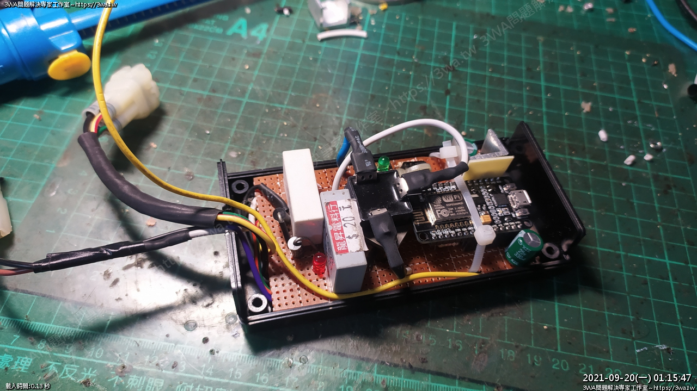
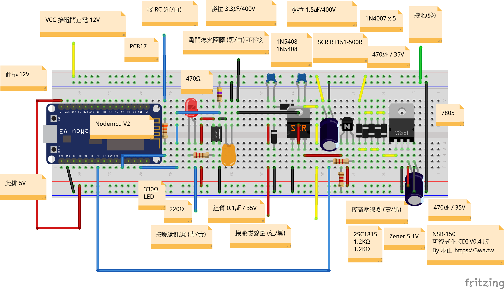
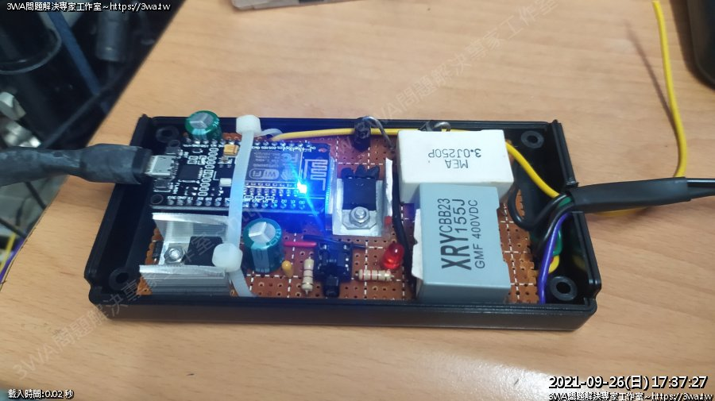

# NSR-150_CDI
利用 Nodemcu V2 開發的 NSR-150 可程式化 CDI
 
 
<h2>動機：</h2>
騎了NSR五年多，這陣子翻維修手冊，看到 CDI 的接線圖 
一直以來都覺得這是一塊很巨大的拚圖，想著想著就推著自己往前走，心中閃過一個想法 
不如~來自製一顆可程式的 CDI 吧~~~ 
 
 
<h2>
Author：羽山 (https://3wa.tw) 
Author：@FB 田峻墉
</h2>
<h2>版本：</h2>
V0.5
 
<h2>最初發布時間：</h2>
2021-09-09
 
<h2>最後更新時間：</h2>
2026-08-21
 
<h2>Nodemcu 使用接腳(V0.1~V0.3版)：</h2>
<ul>
  <li>D1：脈衝 PWM 輸入</li>
  <li>D6：點火 輸出</li>
</ul>
 

(V0.3 版接線圖)

 
 

(V0.3 版成品圖)

 
 
<h2>Nodemcu 使用接腳(V0.4~V0.5版)：</h2>
<ul>
  <li>D1：脈衝 PWM 輸入</li>
  <li>D4：RC 訊號輸出</li>  
  <li>D6：點火 輸出</li>  
</ul>
 

(V0.4 版接線圖)

 
 

(V0.4 版成品圖)

 
 
 
<h2>各版本說明：</h2>
<table>
  <thead>
  <tr>
    <th>版本</th>
    <th>補充說明</td>
    <th>適用程式</td>
  </tr>
  </thead>
  <tbody>
  <tr>
    <td>0.1~0.3</td>
    <td>基本版</td>
    <td>      
      (各版本的程式皆可運作) 
      https://github.com/shadowjohn/NSR-150_CDI/blob/main/CODE/NSR-150_CDI/NSR-150_CDI.ino  
      https://github.com/shadowjohn/NSR-150_CDI/blob/main/CODE/NSR-150_CDI_V0.4/NSR-150_CDI_V0.4.ino
    </td>
  </tr>
  <tr>
    <td>0.4</td>
    <td>
      1.使用 SCR BT151-500R 
      2.讓二期的 RC電腦，變成一期 RC電腦的騎乘體驗
    </td>
    <td>            
      需搭配 V0.4 版程式 
      https://github.com/shadowjohn/NSR-150_CDI/blob/main/CODE/NSR-150_CDI_V0.4/NSR-150_CDI_V0.4.ino
    </td>
  </tr>
  <tr>
    <td>0.5</td>
    <td>
      1.保留 V0.4 點火角表、RC 5,000 rpm 門檻與 200 us SCR 觸發脈寬 
      2.15,000~17,000 rpm 固定使用最後一格 8°，避免點火表插值除以零 
      3.使用 ESP8266 Timer1 one-shot 排程點火，避免主迴圈延遲影響點火時序 
      4.已通過主機端計時測試與 NodeMCU V2 編譯；尚未完成示波器或實車驗證
    </td>
    <td>
      需搭配 V0.5 版程式 
      https://github.com/shadowjohn/NSR-150_CDI/blob/main/CODE/NSR-150_CDI_V0.5/NSR-150_CDI_V0.5.ino
    </td>
  </tr>
  </tbody>
</table>
 
 
<h2>程式版本說明：</h2>
V0.1：符合 V0.1~V0.3 版電路圖設計 
V0.4：RC訊號從 D4 輸出，讓二期 RC 電腦變成一期 RC 電腦的騎乘感覺 
V0.5：保留 V0.4 的點火能量相關設定，改用 Timer1 one-shot 排程點火，並修正 15,000 rpm 以上點火表插值邊界 
 
<h2>V0.5 主機端計時測試：</h2>
在 Windows PowerShell 執行以下命令，可驗證 V0.5 的 RPM 邊界、點火表與延遲計算： 
<code>pwsh.exe -ExecutionPolicy Bypass -File .\tests\run_v0.5_timing_test.ps1</code> 
此測試不會驗證 PC817、SCR、高壓線圈或實際點火角；上車前仍需先以訊號產生器與示波器驗證。
    
 
 
<h2>免責聲明：</h2>
不要學，你們的車一定會壞掉，哈哈 
文章、電路圖與程式皆採滾動式修正
 
 
<h2>詳細心得參考：</h2>
<ul>
  <li>1. 影片參考：https://youtu.be/g--ht7JCfWI</li>
  <li>2. NSR150 自製可程式 CDI - Part1 (序) https://3wa.tw/blog/blog.php?id=1924</li>
  <li>3. NSR150 自製可程式 CDI - Part2 (研究方法目錄) https://3wa.tw/blog/blog.php?id=1926</li>
  <li>4. NSR150 自製可程式 CDI - Part3 (實作練習V0.1~V0.3版) https://3wa.tw/blog/blog.php?id=1930</li>
  <li>5. NSR150 自製可程式 CDI - Part4 (實作練習V0.4版) https://3wa.tw/blog/blog.php?id=1931</li>
  <li>6. NSR150 自製可程式 CDI 程式說明 (V0.4版)：https://3wa.tw/blog/blog.php?id=1934</li>
</ul>  
