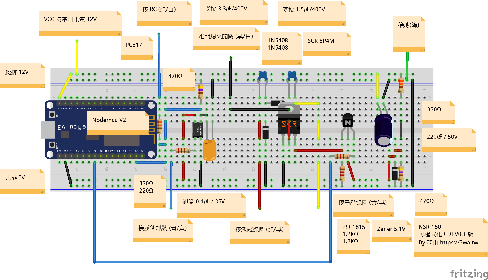

# NSR-150_CDI
利用 Nodemcu V2 開發的 NSR-150 可程式化 CDI
 
 
<h2>動機：</h2>
騎了NSR五年多，這陣子翻維修手冊，看到 CDI 的接線圖 
一直以來都覺得這是一塊很巨大的拚圖，想著想著就推著自己往前走，心中閃過一個想法 
不如~來自製一顆可程式的 CDI 吧~~~ 
 
 
<h2>
Author：羽山 (https://3wa.tw) 
Author：@FB 田峻墉
</h2>
<h2>版本：</h2>
V0.01
 
 
<h2>接腳：</h2>
<ul>
  <li>D1：脈衝 PWM 輸入</li>
  <li>D6：點火 輸出</li>
  <li>D7：TM1637 CLK</li>
  <li>D8：TM1637 DIO</li>
</ul>

 
接線圖
 
 

 
<h2>免責聲明：</h2>
不要學，你們的車一定會壞掉，哈哈 
文章、電路圖與程式皆採滾動式修正
 
 
<h2>詳細心得參考：</h2>
<ul>
  <li>1. 影片參考：https://youtu.be/g--ht7JCfWI</li>
  <li>2. NSR150 自製可程式 CDI - Part1 (序) https://3wa.tw/blog/blog.php?id=1924</li>
  <li>3. NSR150 自製可程式 CDI - Part2 (研究方法目錄) https://3wa.tw/blog/blog.php?id=1926</li>
</ul>  
